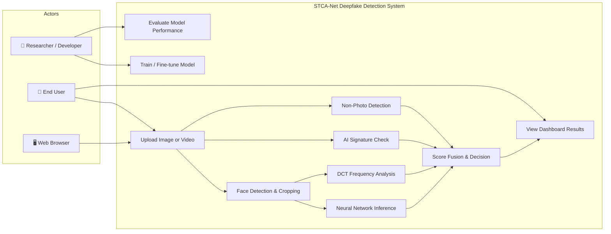
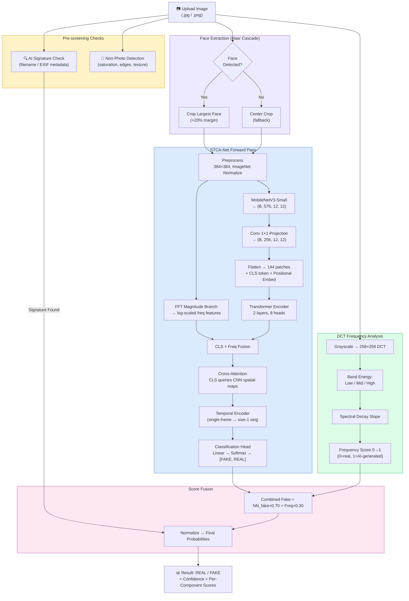
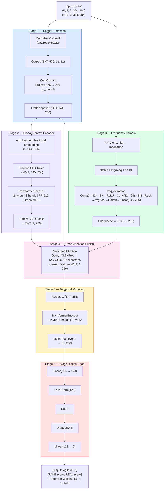
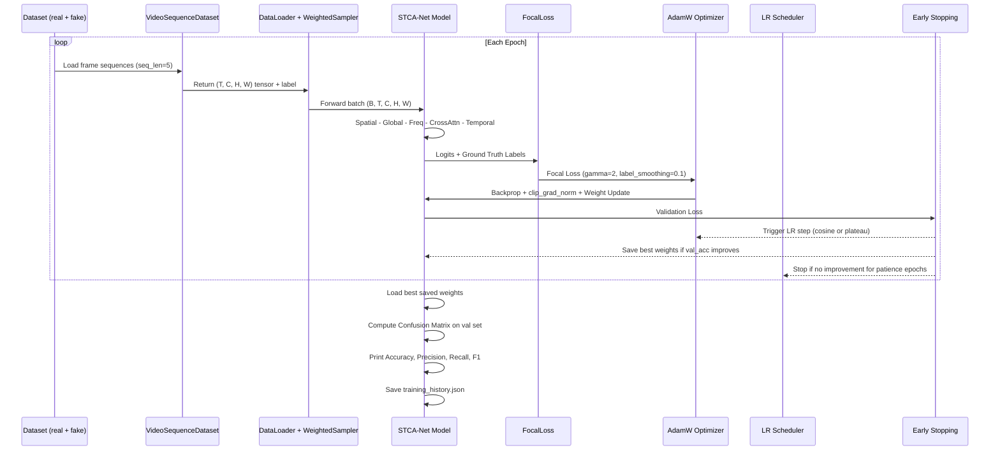
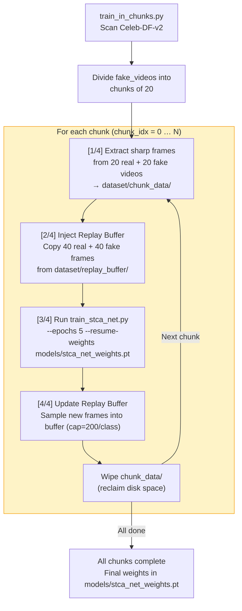
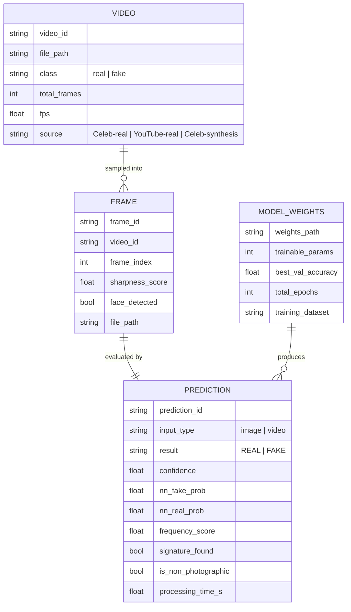
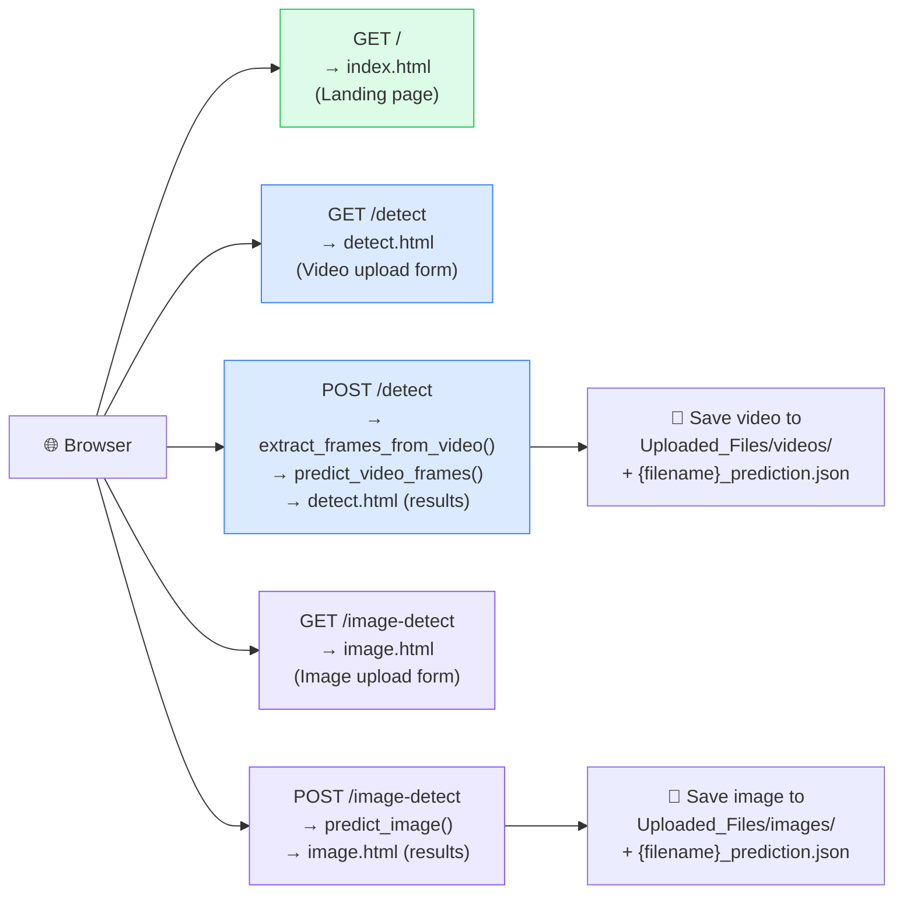

# STCA-Net — System Architecture & Diagrams

> **Project:** STCA-Net (Spatio-Temporal Cross-Attention Network)
> **Purpose:** Hybrid deepfake detection for images and video using CNN + Transformer + Frequency analysis
> **Dataset:** Celeb-DF-v2 (deepfake forensics benchmark)

---

## How to Preview These Diagrams

All diagrams use **Mermaid** syntax. To render them:

| Tool | Steps |
|------|-------|
| **VS Code** | Install the *Mermaid Preview* extension → open `.md` → `Ctrl+Shift+P` → "Mermaid: Preview" |
| **GitHub** | Push this `.md` file — GitHub auto-renders Mermaid blocks |
| **Online** | Paste any block at [mermaid.live](https://mermaid.live) |
| **Obsidian** | Enable "Mermaid" in settings → preview mode renders automatically |

---

## 1. Use Case Diagram

---

## 2. Full Inference Pipeline — Image

---

## 3. STCA-Net Model Architecture

---

## 4. Video Inference Pipeline

```mermaid
flowchart LR
    V["🎬 Upload Video\n(.mp4 / .avi / .mov)"]

    subgraph FrameExtract["Smart Frame Extraction (video_processing.py)"]
        FE1["Divide video into\n15 equal intervals"]
        FE2["Sample up to 5 frames\nper interval"]
        FE3["Select sharpest frame\n(Variance of Laplacian)"]
        FE4["Haar Cascade\nFace Detection + Crop"]
        FE5["Return: List of\n15 PIL Images (faces)"]
    end

    subgraph SequenceInfer["Sequence Inference (prediction.py)"]
        SI1["Preprocess each frame\n384×384, Normalize"]
        SI2["Stack: (1, 15, 3, 384, 384)"]
        SI3["STCA-Net forward\n(temporal sequence mode)"]
        SI4["Softmax → avg_nn_fake / avg_nn_real"]
        SI5["Per-frame individual\nforward passes (for timeline chart)"]
    end

    subgraph FreqVideo["Per-Frame Frequency Scores"]
        FV["DCT analysis on\neach frame independently\n→ avg_freq_score"]
    end

    subgraph FusionV["Score Fusion"]
        FU["Combined Fake = avg_nn_fake×0.70 + avg_freq×0.30\nNormalize → REAL/FAKE + Confidence"]
    end

    Result["📊 Result:\nPrediction | Confidence | Frames Analyzed\nNN Scores | Freq Score\nPer-frame Fake Scores | Per-frame Freq Scores"]

    V --> FE1 --> FE2 --> FE3 --> FE4 --> FE5
    FE5 --> SI1 --> SI2 --> SI3 --> SI4
    FE5 --> SI5
    FE5 --> FV
    SI4 --> FU
    FV --> FU
    FU --> Result

    style FrameExtract fill:#ede9fe,stroke:#8b5cf6
    style SequenceInfer fill:#dbeafe,stroke:#3b82f6
    style FreqVideo fill:#dcfce7,stroke:#22c55e
    style FusionV fill:#fce7f3,stroke:#ec4899
```

---

## 5. Training Lifecycle Sequence

---

## 6. Chunk-Based Training with Replay Buffer

---

## 7. System Entity Relationship

---

## 8. Flask Web Application Routes

