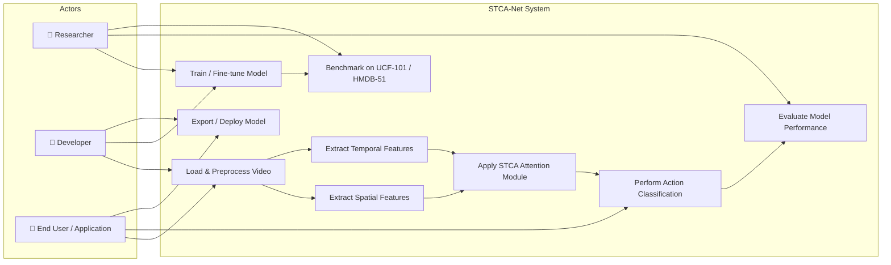
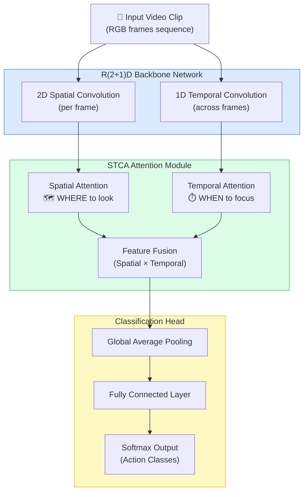
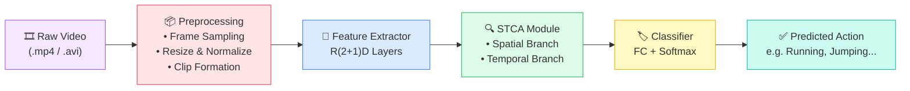
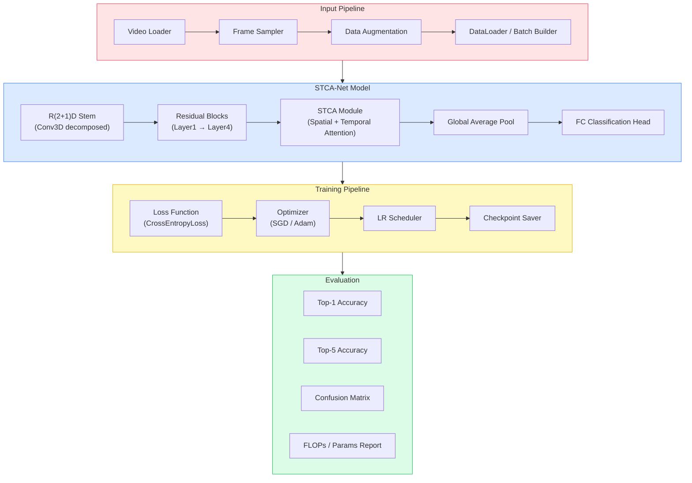
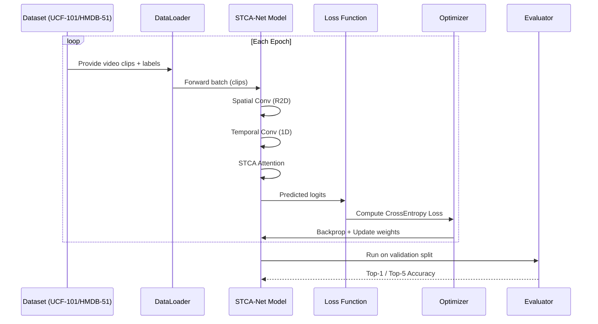
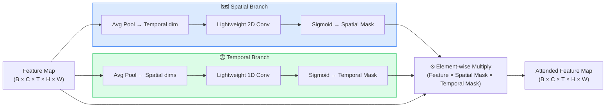
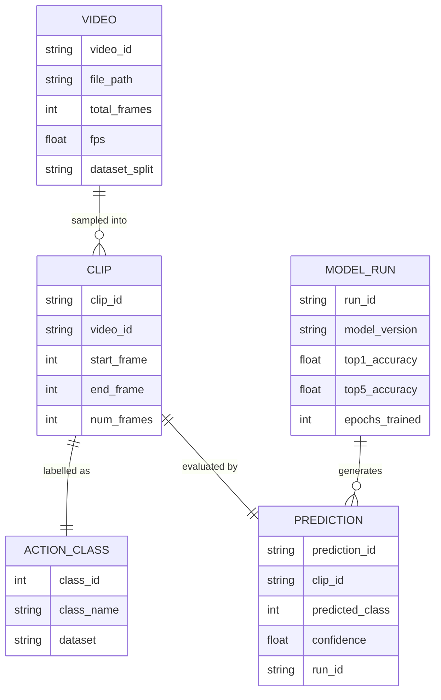

# STCA-Net Project — System Overview & Use Case Diagrams

> **Project:** STCA-Net (Spatio-Temporal Convolutional Attention Network)  
> **Purpose:** Efficient Video Action Recognition using Deep Learning  
> **Backbone:** R(2+1)D Network + STCA Attention Module  
> **Benchmark Datasets:** UCF-101 | HMDB-51

---

## How to Preview These Diagrams

All diagrams below use **Mermaid** syntax. To render them:

| Tool | Steps |
|------|-------|
| **VS Code** | Install the *Mermaid Preview* extension → open `.md` → `Ctrl+Shift+P` → "Mermaid: Preview" |
| **GitHub** | Push this `.md` file — GitHub auto-renders Mermaid blocks |
| **Online** | Paste any block at [mermaid.live](https://mermaid.live) |
| **Obsidian** | Enable "Mermaid" in settings → preview mode renders automatically |
| **Notion** | Use `/code` block → select `Mermaid` as language |

---

## 1. Use Case Diagram

---

## 2. System Architecture Overview

---

## 3. Data Flow Diagram

---

## 4. Component Diagram

---

## 5. Training Lifecycle Sequence

---

## 6. STCA Module Internal Design

---

## 7.  System Entity Relationship (Conceptual)

