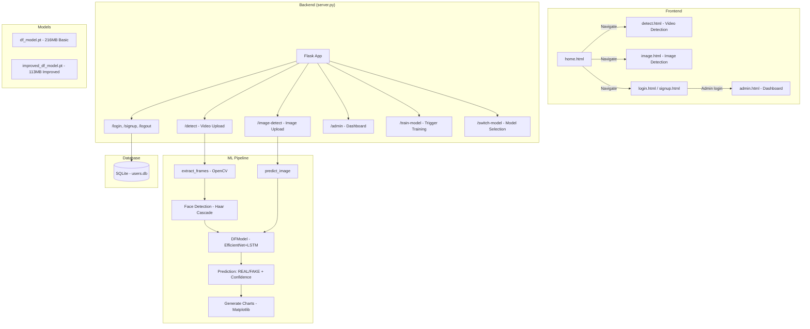
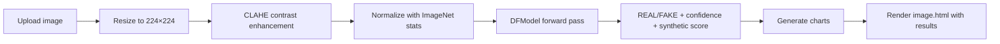

# TrueVision — DeepFake Detection: Project Walkthrough

## Overview

**TrueVision** is a Flask-based web application that detects whether a video or image is **REAL** or **FAKE** (deepfake) using a deep learning model built on **EfficientNet-B2 + Bidirectional LSTM with Attention**.

---

## Architecture Diagram



---

## How It Works — Step by Step

### 1. User Flow

| Step | Action | Route |
|------|--------|-------|
| 1 | User visits the landing page | `GET /` → [home.html](file:///c:/Users/boddu/Downloads/dfd%20%281%29/templates/home.html) |
| 2 | User signs up / logs in | `POST /signup` or `POST /login` |
| 3 | User uploads a **video** | `POST /detect` |
| 4 | User uploads an **image** | `POST /image-detect` |
| 5 | Results displayed with charts | Same page, with [data](file:///c:/Users/boddu/Downloads/dfd%20%281%29/server.py#1216-1228) context |
| 6 | Admin manages users & training | `GET /admin` |

### 2. Video Detection Pipeline (`/detect`)

```mermaid
flowchart LR
    A[Upload .mp4/.avi/.mov] --> B[Save to Uploaded_Files/]
    B --> C["extract_frames() — 8 frames"]
    C --> D["Face detection (Haar Cascade)"]
    D --> E["Crop & resize to 112×112"]
    E --> F["Build tensor sequence"]
    F --> G["DFModel forward pass"]
    G --> H["Softmax → REAL/FAKE + confidence%"]
    H --> I["Generate 7 charts (Matplotlib)"]
    I --> J[Render detect.html with results]
    J --> K[Delete uploaded file]
```



**Key details:**
- **Frame extraction**: Selects 8 evenly-distributed frames across the video
- **Face detection**: Uses OpenCV Haar Cascade (replaced MediaPipe for Python 3.13 compatibility)
- **Fallback**: If no face detected, uses the full resized frame
- **Deterministic inference**: Seeds are fixed for reproducible results

### 3. Image Detection Pipeline (`/image-detect`)



### 4. The DFModel Neural Network

Defined in [server.py](file:///c:/Users/boddu/Downloads/dfd%20(1)/server.py#L1444-L1589) (class [DFModel](file:///c:/Users/boddu/Downloads/dfd%20%281%29/server.py#1445-1590)):

```
Input Image(s) [B, seq, 3, H, W]
        │
        ▼
┌─────────────────────┐
│  EfficientNet-B2     │  ← Pretrained backbone, feature extraction
│  (frozen classifier) │
└────────┬────────────┘
         │ 1408-dim features
         ▼
┌─────────────────────┐
│  Feature Extractor   │  ← 2-layer MLP with LayerNorm + Dropout
│  + Residual Skip     │  ← shortcut connection for gradient flow
└────────┬────────────┘
         │ 1024-dim
         ▼
┌─────────────────────┐
│  Spatial Attention   │  ← per-frame importance weighting
└────────┬────────────┘
         ▼
┌─────────────────────┐
│  Bi-LSTM (2 layers)  │  ← temporal modeling across frames
└────────┬────────────┘
         │ 1024-dim (512×2 bidirectional)
         ▼
┌─────────────────────┐
│  Multi-Head Temporal │  ← 8-head attention over LSTM outputs
│  Attention           │
└────────┬────────────┘
         │
    ┌────┴────┐
    ▼         ▼
┌────────┐ ┌──────────┐
│Main Head│ │Synthetic │  ← binary: is it AI-generated?
│REAL/FAKE│ │Head (σ)  │
└────────┘ └──────────┘
```

### 5. Dual Model System

The app supports **two models** loaded simultaneously:

| Model | File | Size | Notes |
|-------|------|------|-------|
| Basic | [model/df_model.pt](file:///c:/Users/boddu/Downloads/dfd%20%281%29/model/df_model.pt) | 216 MB | Original model |
| Improved | [model/improved_df_model.pt](file:///c:/Users/boddu/Downloads/dfd%20%281%29/model/improved_df_model.pt) | 113 MB | Retrained model |

- The **improved model** is preferred by default (auto-selection)
- Users can switch via `/switch-model/<type>` API
- Both share the same [DFModel](file:///c:/Users/boddu/Downloads/dfd%20%281%29/server.py#1445-1590) architecture

### 6. Confidence & Visualization

After prediction, **7 charts** are generated using Matplotlib:

1. **Confidence Pie Chart** — Real vs Fake split
2. **Confidence Meter** — vertical bar gauge
3. **Comparison Bar Chart** — vs FaceForensics++, DFDC, DeeperForensics
4. **Horizontal Bar Chart** — with model type labels
5. **Radar Chart** — top 3 models comparison
6. **Distribution Chart** — histogram of all model accuracies
7. **Detailed Analysis Report** — 7-subplot grid (result summary, processing time breakdown, performance metrics, frame quality, confidence timeline, reliability gauge)

---

## Key Files

| File | Purpose |
|------|---------|
| [server.py](file:///c:/Users/boddu/Downloads/dfd%20(1)/server.py) | Main Flask app — all routes, ML inference, chart generation (1874 lines) |
| [models.py](file:///c:/Users/boddu/Downloads/dfd%20(1)/models.py) | SQLAlchemy [User](file:///c:/Users/boddu/Downloads/dfd%20%281%29/models.py#8-24) model with password hashing |
| [advanced_training.py](file:///c:/Users/boddu/Downloads/dfd%20(1)/advanced_training.py) | Training script — [AdvancedDFModel](file:///c:/Users/boddu/Downloads/dfd%20%281%29/advanced_training.py#218-379), dataset loaders, Focal Loss, mixed precision |
| [requirements.txt](file:///c:/Users/boddu/Downloads/dfd%20(1)/requirements.txt) | Dependencies: Flask, PyTorch, OpenCV, Matplotlib, etc. |

### Templates (HTML)

| Template | Route | Function |
|----------|-------|----------|
| [home.html](file:///c:/Users/boddu/Downloads/dfd%20%281%29/templates/home.html) | `/` | Landing page |
| [detect.html](file:///c:/Users/boddu/Downloads/dfd%20%281%29/templates/detect.html) | `/detect` | Video upload + results display |
| [image.html](file:///c:/Users/boddu/Downloads/dfd%20%281%29/templates/image.html) | `/image-detect` | Image upload + results display |
| [login.html](file:///c:/Users/boddu/Downloads/dfd%20%281%29/Admin/login.html) | `/login` | User login form |
| [signup.html](file:///c:/Users/boddu/Downloads/dfd%20%281%29/templates/signup.html) | `/signup` | User registration |
| [admin.html](file:///c:/Users/boddu/Downloads/dfd%20%281%29/templates/admin.html) | `/admin` | Admin dashboard (users, datasets, training) |
| `privacy.html` | `/privacy` | Privacy policy |
| `terms.html` | `/terms` | Terms of service |

---

## Database

- **SQLite** at `instance/users.db`
- Single `User` table: `id`, `email`, `username`, `password_hash`
- Passwords hashed with Werkzeug's `generate_password_hash`
- Default admin: `admin / password` (auto-created on startup)
- Flask-Login handles sessions

---

## Training (advanced_training.py)

Triggered from admin dashboard via `POST /train-model` (runs in a background thread):

- **Model**: `AdvancedDFModel` — same architecture as `DFModel` but with **high-frequency residual fusion** (FFT-based synthetic fingerprint channel)
- **Loss**: 70% Focal Loss + 30% Label Smoothing Loss
- **Optimizer**: AdamW with cosine annealing warm restarts
- **Mixed precision**: PyTorch AMP for faster training
- **Datasets**: Celeb-DF, YouTube-Real, FaceForensics++
- **Augmentations**: Albumentations (CLAHE, noise, compression, color jitter) + synthetic corruption simulation

---

## Deployment Options

| Method | Config File |
|--------|-------------|
| Local | `python server.py` (port 10000) |
| Docker | `Dockerfile` |
| Render | `render.yaml` / `render.toml` |
| Vercel | `.vercel/` config |
